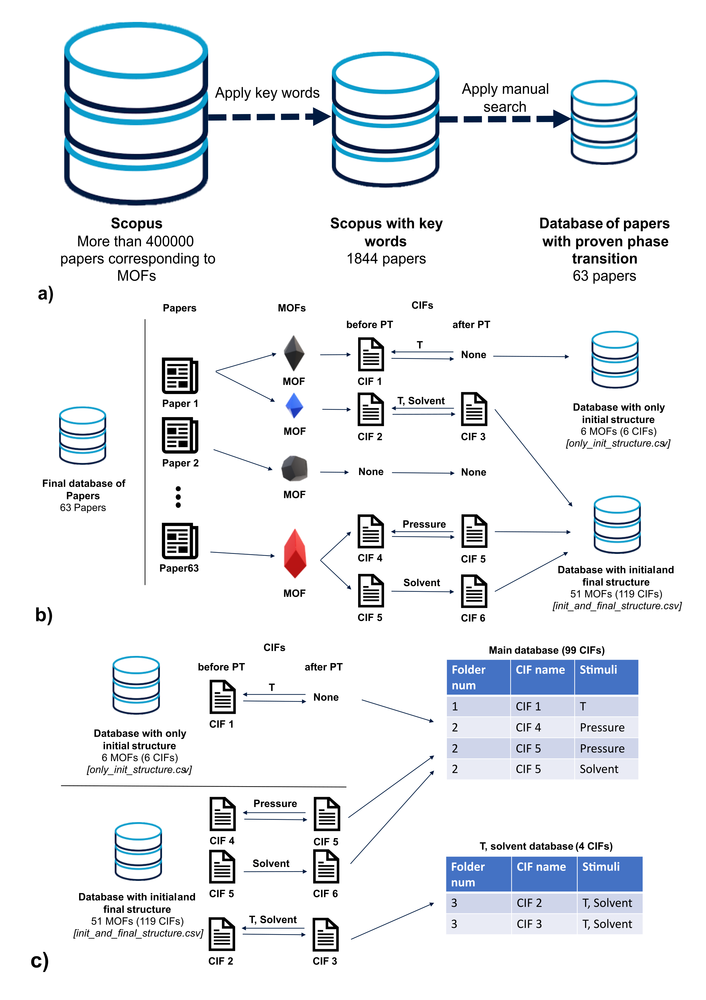

# Database Overview

## Directory: `cifs`
This directory houses downloaded files associated with various articles. Each subfolder within is labeled starting with a numerical index, which corresponds to the 'Folder num' field found in the provided CSV files. Following this index is the article's DOI, modified for compatibility by substituting '/' with '_'. These folders contain `.cif` files representing the initial, final (when available), and other structural configurations of Metal-Organic Frameworks (MOFs) as detailed in the respective articles.

## Directory: `csv`
Within this directory, you'll find CSV files that contain manually extracted data regarding the reversibility and stimuli of the MOFs as reported in the articles:
- **`init_and_final_structure.csv`**: This file includes information on both the initial and final structures of the MOFs.
- **`only_init_structure.csv`**: This file documents cases where only the initial structure of the MOF is available, with no final structure reported.

## Script: `create_data.py`
A Python script designed to process the data from the above CSV files, generating two new files, `main.csv` and `t_solvent.csv`, which compile the extracted data for further analysis. Detailed instructions on how this data extraction process works can be found in the Supplementary Information section of our article or by referring to the schematic provided below.

    

